# Lab 02: Building LLMs Orchestration Flows

### Estimated Time: 60 mins

## Lab Objectives

After completing this lab, you will be able to complete the following tasks:

- Task 01: Create a standard classification flow
- Task 02: Create a conversational RAG flow

## Task 01: Create a standard classification flow

1. In the Azure AI Studio, navigate to **Tools > Prompt flow** and click on **+ Create**.

   

1. In the flow creation window, select the **Standard flow** filter in the **Explore gallery** section and click on **Clone** for the Web Classification.

   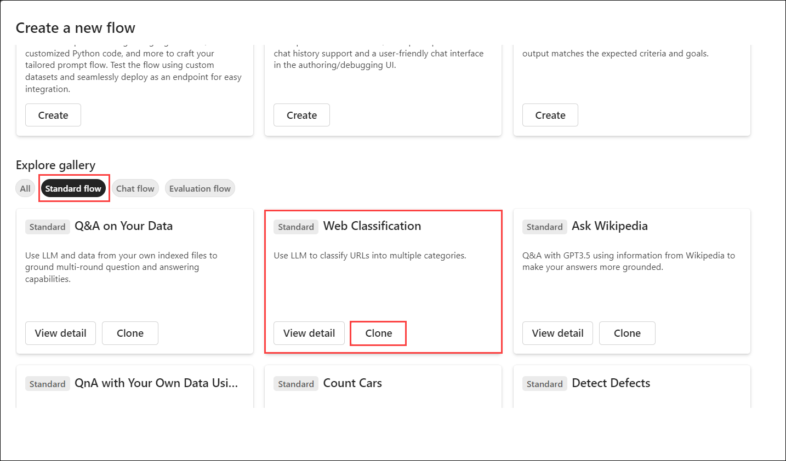

1. In the Clone flow window, accept the default folder name value and click on **Clone**.

    

1. A Standard flow will be created with the following structure.

    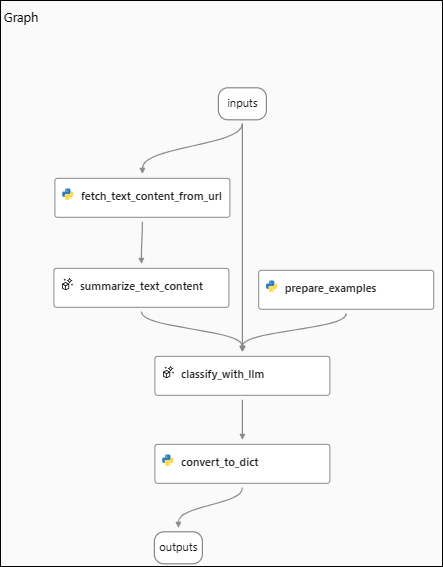

1. Notice that the flow has five nodes:

   - The first **fetch_text_content_from_url** is a Python node to extract the text from a Web page.
   - Then the content obtained by the extraction serves as input for an LLM node **summarize_text_content** to summarize the content.
   - The summarization, combined with the classification examples generated by a python node **prepare_examples** is the input for another LLM node **classify_with_llm** where the classification is performed.
   - At the end, we have a Python node **convert_to_dict** responsible for formatting the output of the flow in a Python dictionary format.
  
1. Now that the flow has been created, we need a runtime to execute it in the Prompt Flow. Select **Start Compute Session** to start a runtime to run your flow.

    

   >**Note:** It will take 1-3 minutes to start the session.

1. After starting the Runtime, we need to define the Connection with the LLM for each LLM step. In our case, these are **summarize_text_content** and **classify_with_llm**.

1. We will use the Default_AzureOpenAI Connection and **gpt-4** deployment, which connects to the Azure OpenAI resource that was created when the Azure AI project was set up.

   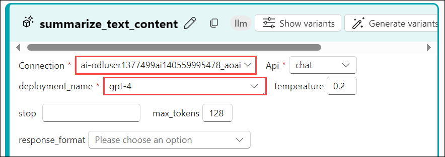

1. Associate the same Connection for the **classify_with_llm** step.

   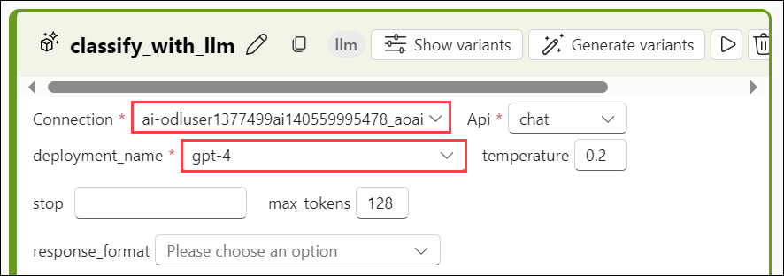

   >**Note:** You can leave the **response_format** field in **blank** or select the **{"type":"text"}**.

1. Once the Runtime is selected and the Connections are configured, you can start the flow by clicking the **Run** button at the top of the page.

   

1. After finishing the execution you will see that the flow is complete with all steps.

   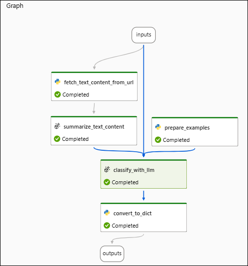

1. You can view the result of the processing by clicking the last node.

## Task 02: Create a conversational RAG flow

1. In the Azure AI Studio, navigate to **Tools > Prompt flow** and click on **+ Create**.

   

1. In the flow creation window, select the **Chat flow** filter in the **Explore gallery** section and click on **Clone** for the Multi-Round Q&A on Your Data.

   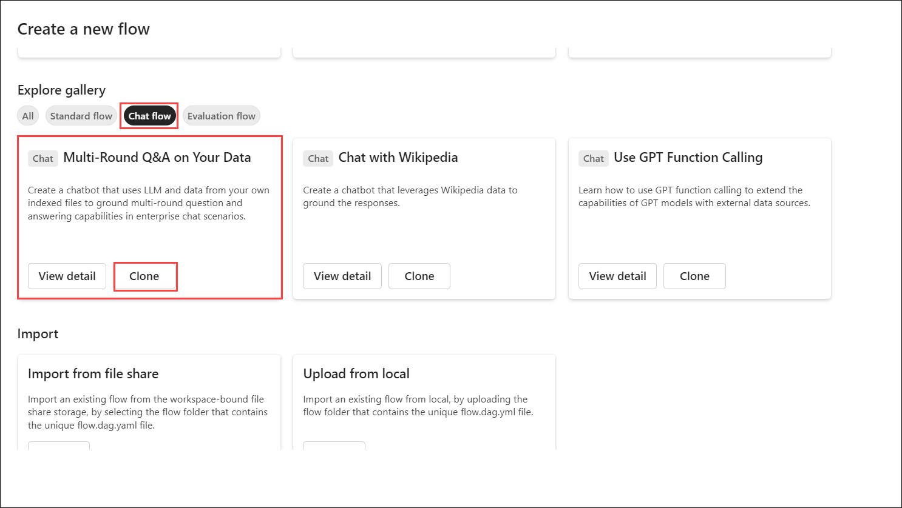

1. In the Clone flow window, accept the default folder name value and click on **Clone**.

1. A Chat flow will be created with the following structure.

   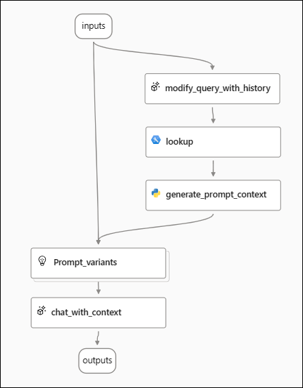

1. Select **Start Compute Session** to start a runtime to run your flow.

   

   >**Note:** It will take 1-3 minutes to start the session.

1. Click the **Save** button to save your flow.

   

1. Flow overview:

   - The first node, **modify_query_with_history**, produces a search query using the user's question and their previous interactions.
   - Next, in the **lookup** node, the flow uses the vector index to conduct a search within a vector store, which is where the RAG pattern retrieval step takes place.
   - Following the search process, the **generate_prompt_context** node consolidates the results into a string.
   - This string then serves as input for the **Prompt_variants** node, which formulates various prompts.
   - Finally, these prompts are used to generate the user's answer in the **chat_with_context** node.

1. Before you can start running your flow, a crucial step is to establish the search index for the Retrieval stage. This search index will be provided by the Azure AI Search service.

1. Navigate to **Components > Indexes** and click on **+ New Index** to create a new vector index.

   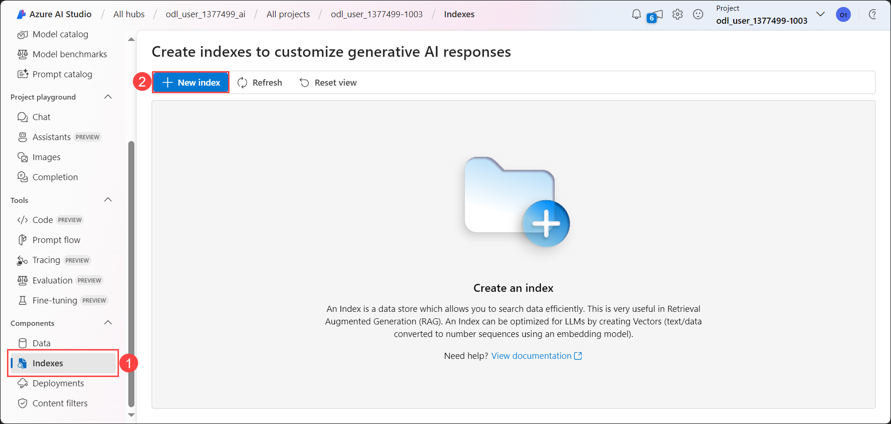

1. On the Source Data tab, select **Upload files** from the dropdown and upload the PDF **surface-pro-4-user-guide-EN.pdf** from your **C:\LabFiles** folder and click on **Next**.

   

1. On the Index Settings tab, select **Connect other Azure AI Search resource** from the Select Azure AI Search Service dropdown.

   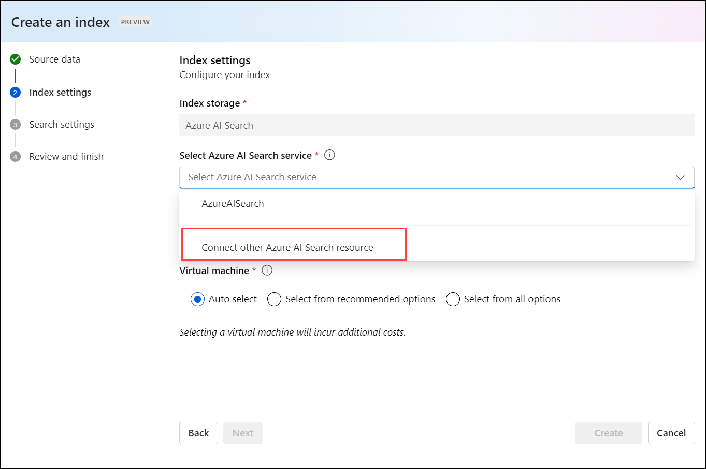

1. On the **Connect an existing resource** window, click on **Add connection**.

   

1. Back on the Create an Index window, on the Index Settings tab, accept the default values for name and auto-select VM and click on **Next**.
   
   

1. On the Search Settings tab, verify that the **Add vector search to this search resource** is selected.

   >**Note:** Azure OpenAI embedding model, **text-embedding-ada-002** (Version 2), will be deployed if not already.

   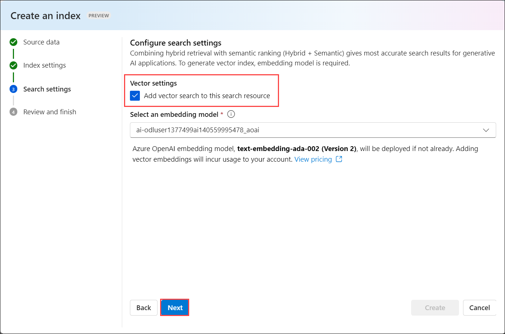

1. On the Review and finish tab, review your settings and click on **Create**.

   >**Note:** The indexing job will be created and submitted for execution. It may take about 10 minutes from the time it enters the execution queue until it starts.

   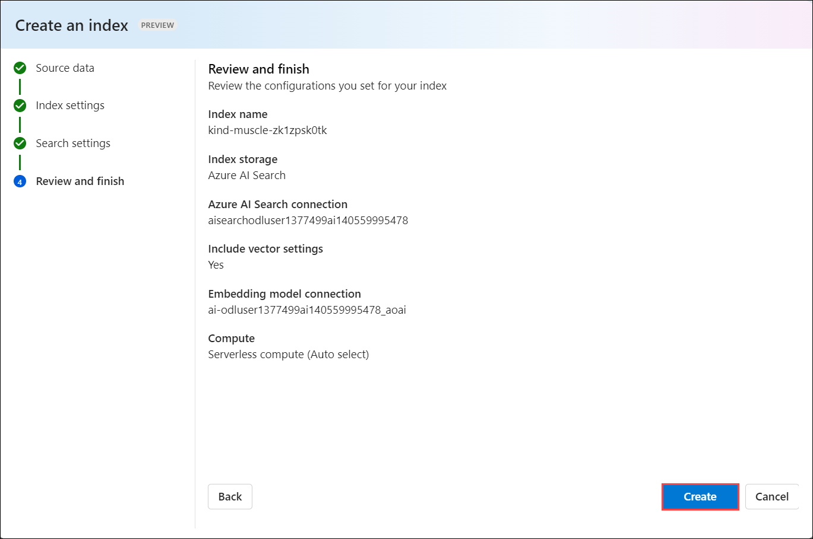

1. Wait until the index status is **Completed** before proceeding with the next steps.

   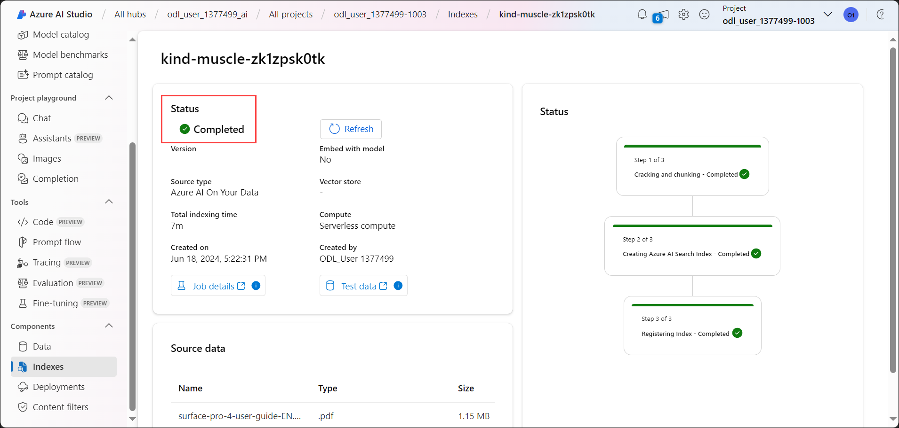

1. Now return to the RAG flow created in the Prompt flow to configure the **lookup** node.

1. After selecting the **lookup** node, click on **mlindex_content** value.

   

1. On the **Generate** window, select **Registered Index** from the index_type dropdown, select your recently created vector index, and click on **Save**.

   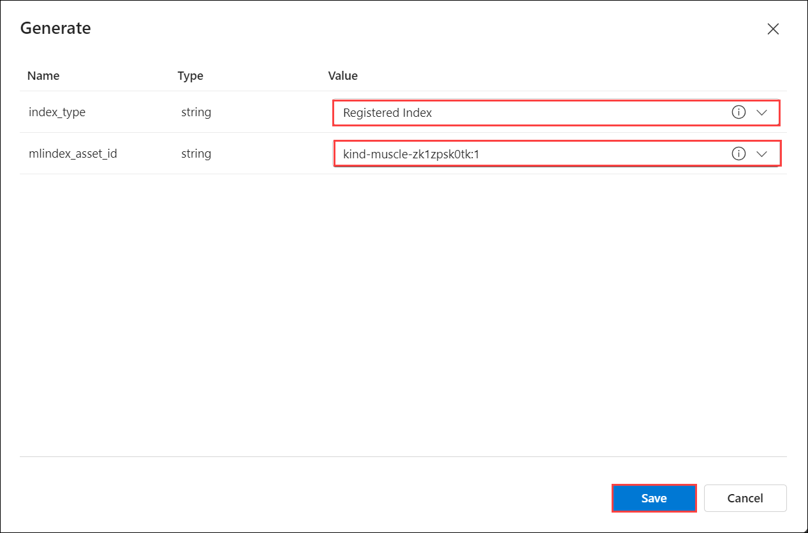

1. Back on the **lookup** node, select the **Hybrid (vector + keyword)** option from the **query_type** field.

   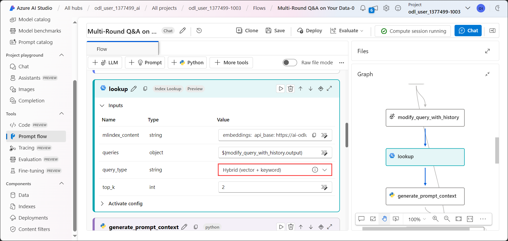

1. Now, let us define the connections of the nodes that link with LLM models. Select your default connection value from the dropdown and select **gpt-4** for the deployment name for both **modify_query_with_history** and **chat_with_context** nodes.

   

   

1. Click on **Save** after configuring the connections for the nodes.

1. Everything is now set up for you to initiate your chat flow. Simply click on the blue **Chat** button located at the top right corner of your page to begin interacting with the flow.

   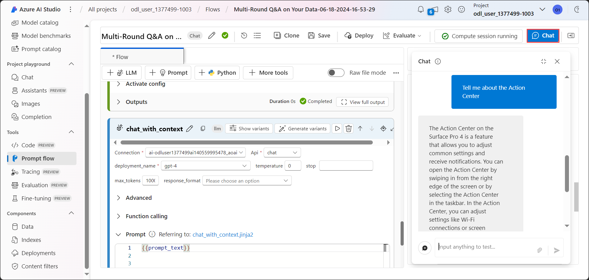
   
1. Ask questions in regards to the PDF in the Chat box to get the relevant answers.

   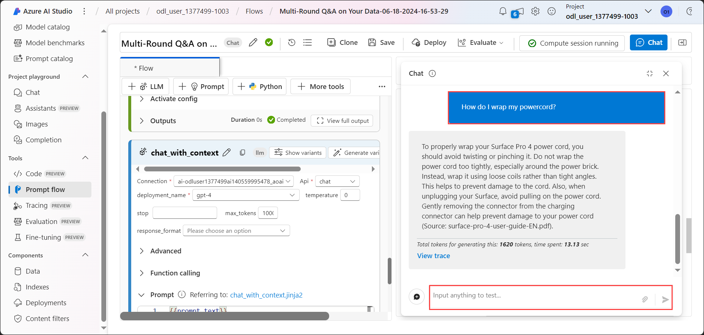

## Review

In this lab, you have performed  the following tasks:

- Created a standard classification flow
- Created a conversational RAG flow

### You have successfully completed the lab.
