## Lab 04: Monitoring and Responsible AI 

### Estimated Time: 60 mins

## Lab Objectives

After completing this lab, you will be able to complete the following tasks:

- Task 01: Monitoring your LLMs flow
- Task 02: Add Content Safety to Your Solution

## Task 01: Monitoring your LLMs flow

1. Once the **Multi-Round Q&A on Your Data** flow deployment succeeds to an online endpoint, navigate to the **Components > Deployments** section and select your recently created deployment.

1. On the **Details** tab, click on **Enable** within the *Enable generation quality monitoring* box.

   

1. On the **Enable monitoring** window, select all the metrics to monitor, configure column mapping, select your Azure OpenAI Connection and Deployment and click on **Create**.

   >**Note:** Monitoring sets the default sampling rate at 10%. This means that if 100 requests are sent to your deployment, 10 get sampled and used to compute the generation quality metrics. You can adjust the sampling rate in the settings.

   

1. On the **Operational** tab, view the operational metrics for the deployment in near real-time. The supported metrics are:

   - Request count
   - Latency
   - Error rate
  
   

1. The results in the **Monitoring (preview)** tab of your deployment provide insights to help you proactively improve the performance of your prompt flow application.

## Task 02: Add Content Safety to Your Solution

1. In your Azure AI Studio, navigate to **Tools > Prompt flow** and click on **+ Create**.

   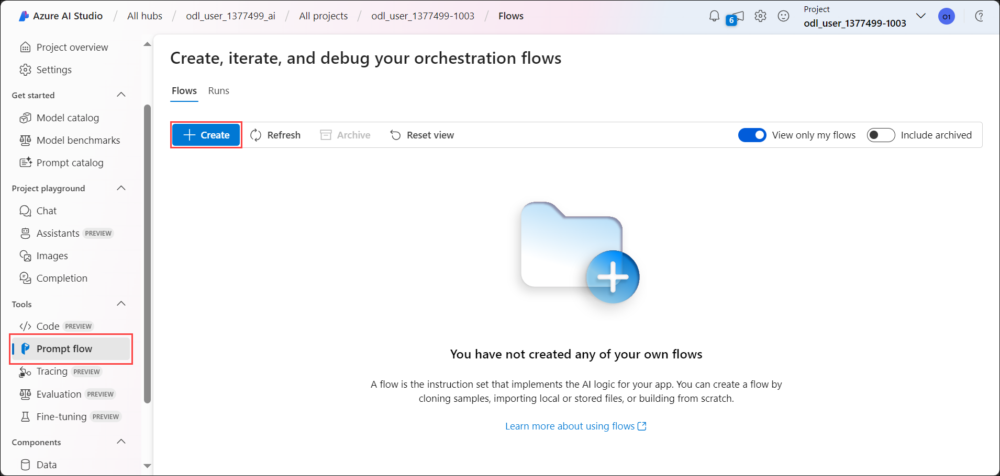

1. On the **Create a new flow** window, click on **Create** for **Standard flow**.

   

1. In the Clone flow window, name the folder name **standard-joke-flow** and click on **Create**.

   

1. A standard joke flow will be created in the following structure.

   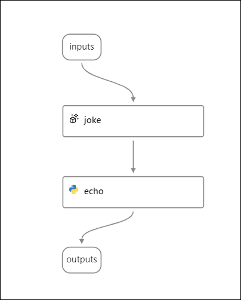

1. In the standard joke flow, delete the **echo** node, as you will be adding two Python nodes to process the output from the Content Safety tool, determine whether to proceed with the standard flow or not, and craft a default response. Click on the **Delete step** once the **Confirm Deletion** pop-up appears.

   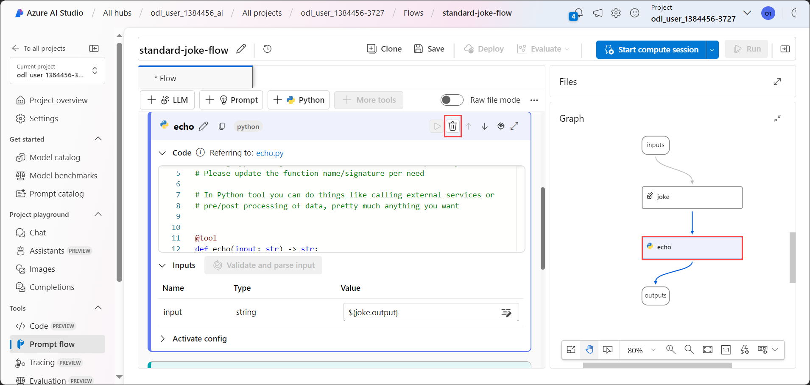

1. Notice that the outputs node disappears from the graph since the **outputs** node was configured to fetch the output value from the **echo** node.

1. Navigate to the **Outputs** section in the standard flow and change the **outputs** value to **${joke.output}**.

   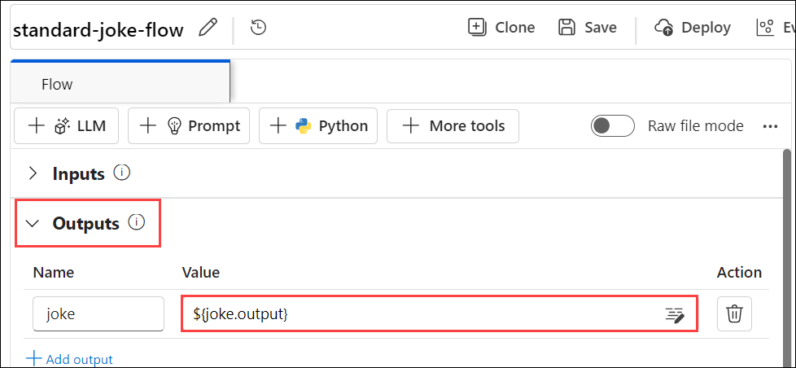

1. Now let's add a Content Safety text tool to the flow. Click on **+ More tools** and select **Content Safety (Text Analyze)**.

   >**Note:** Start the compute session for your standard joke flow to add more tools.

   

1. Enter the node name as **content_safety** and click on **Add**.

   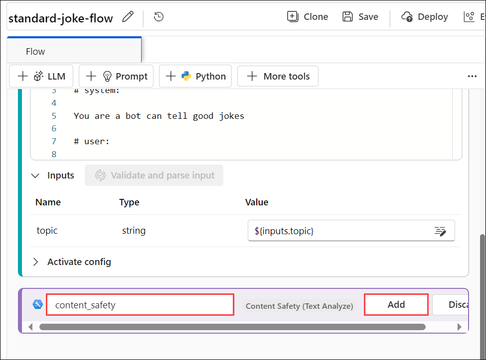

1. Configure the inputs for the *content_safety* tool by selecting the following values:

   - connection: **Content Safety resource**
   - text: **${inputs.topic}**

   

1. Add a Python node to process the output from the Content Safety tool and determine whether to proceed with the standard flow or not. Click on **+ Python**, name the node as **content_safety_check** and click on **Add**.

   

1. Navigate to the **C:\LabFiles** folder to locate the **content_safety_check.py** file. Copy the content of this file into the **content_safety_check** node, click on **Validate and parse input**, and configure the **input1** value as **${content_safety.output}**.

   

1. Add a Python node to craft a default response. Click on **+ Python**, name the node as **generate_result** and click on **Add**.

   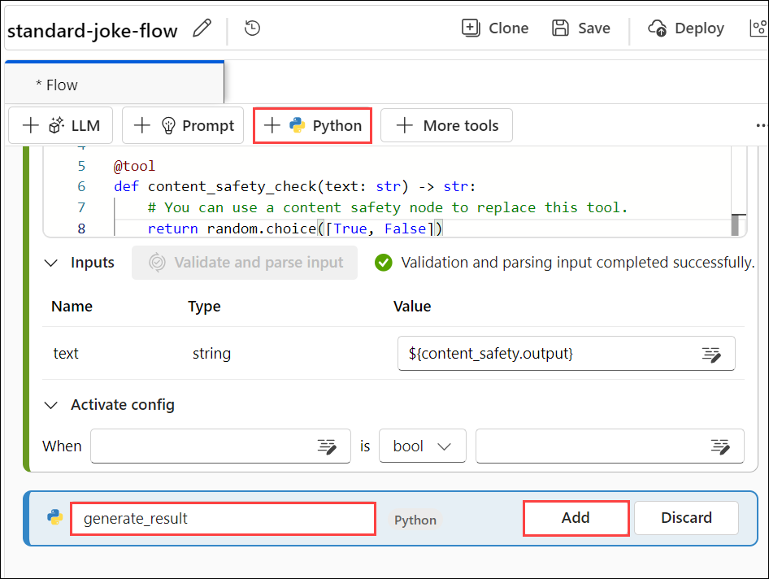

1. Navigate to the **C:\LabFiles** folder to locate the **generate_result.py** file. Copy the content of this file into the **generate_result** node, click on **Validate and parse input** and configure the following inputs.

   - default_result: **${content_safety_check.output}**
   - llm_result: **${joke.output}**

   

1. Navigate back to the **Outputs** section in the standard flow and change the **outputs** value to **${generate_result.output}**.

   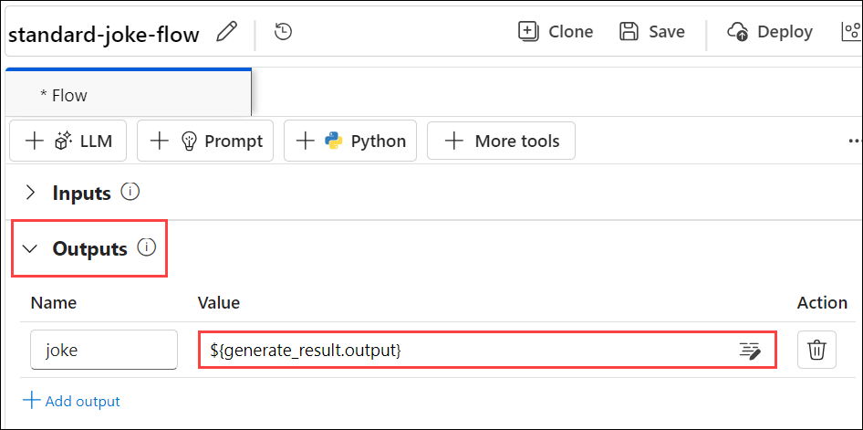

1. Define the Connection with the LLM for the **joke** node by selecting the Default_AzureOpenAI Connection and **gpt-4** deployment, which connects to the Azure OpenAI resource that was created when the Azure AI project was set up.

   

1. After configuring all the nodes, your standard joke flow will be in the following structure.

   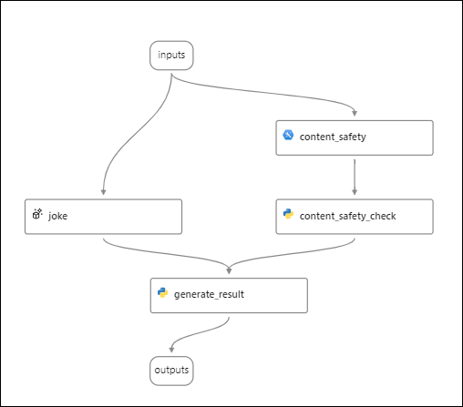

1. Flow Overview:

   - The **joke** node combined with the **content_safety** node detects any harmful content from different modalities and languages from the input topic.
   - The **content_safety_check** python node is setting up a function (content_safety_check) decorated with @tool, which may integrate additional functionality provided by the tool decorator. The function itself uses the random module to randomly determine the safety of content by returning either True or False.
   - The **generate_result** python node returns a specified result (llm_result) if available, or a default result (default_result) if llm_result is not provided or empty.

1. To run the flow, enter an offensive topic as the input for the joke to be generated and click on **Run**.

   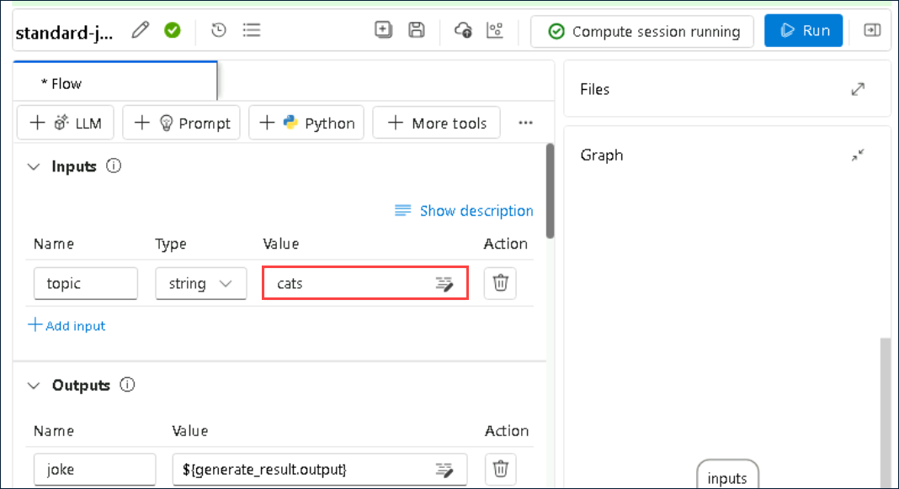

1. Notice how the **content_safety** node rejects the offensive or hateful input topics.

   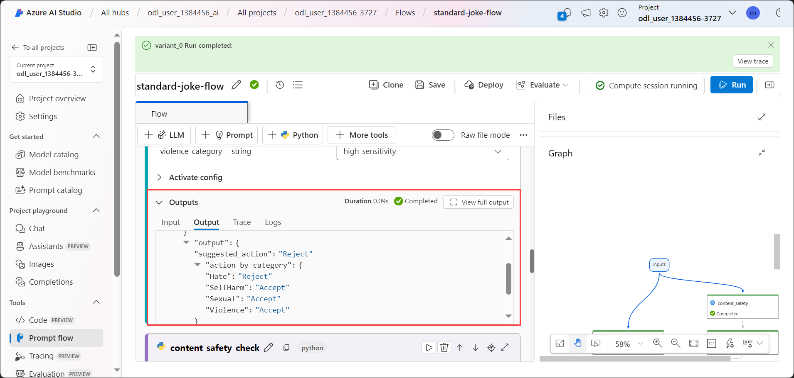

1. Also notice in the outputs in the **generate_result** node, where it doesn't generate the joke on the offensive/hateful topic and provides an alternate light-hearted and non-offensive joke.

   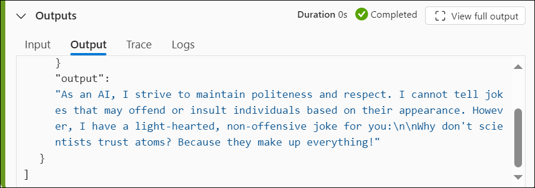

# Review

In this lab, you have performed  the following tasks:

- Monitored your LLMs flow
- Added Content Safety to Your Solution

### You have successfully completed the lab.

